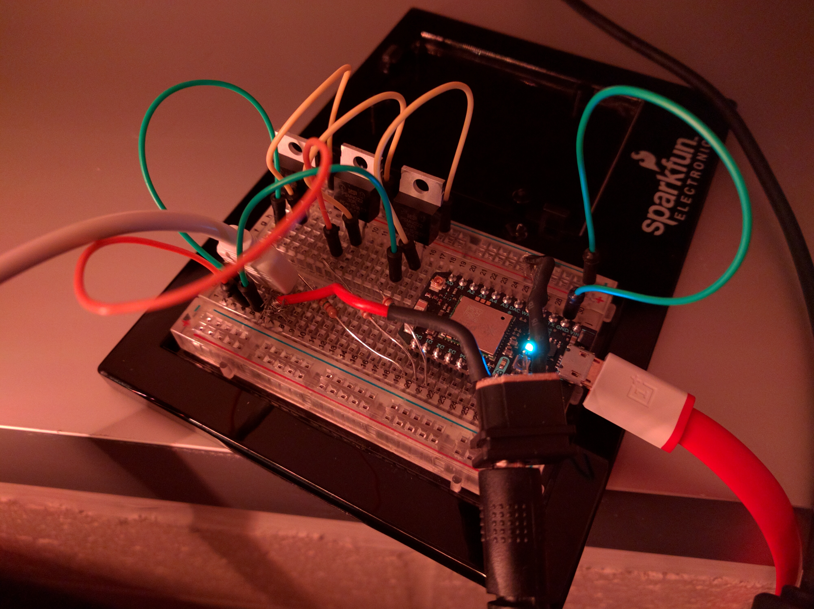
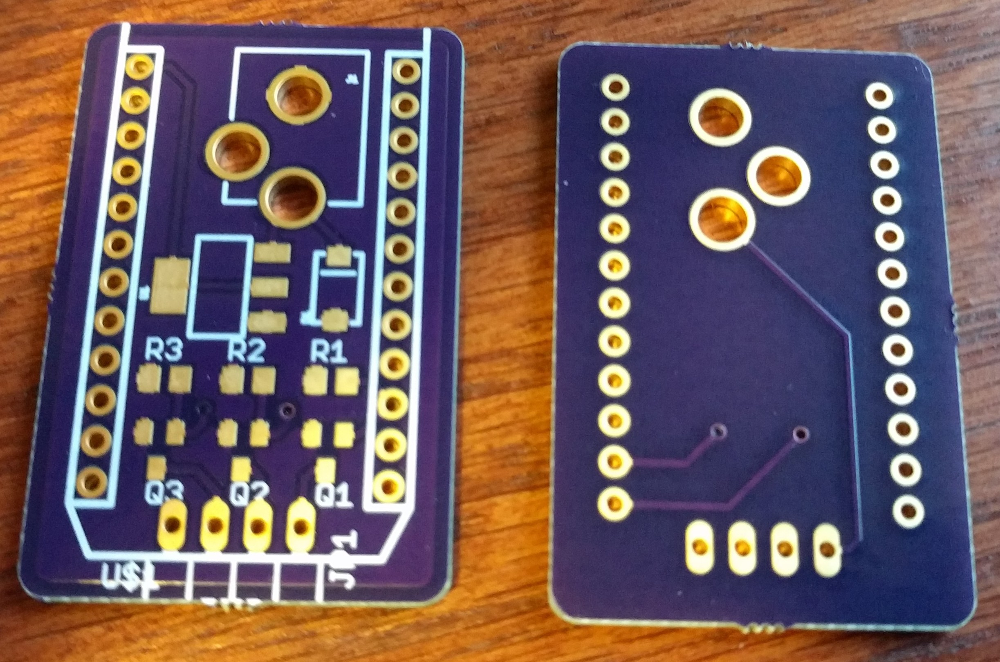
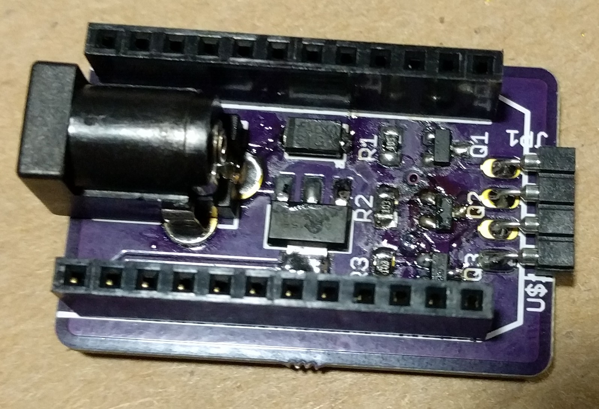
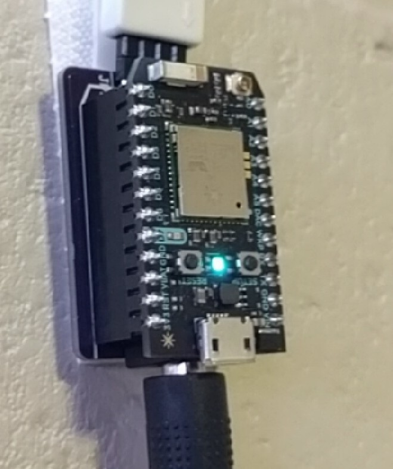

# Bedroom LEDs
This is the code that drives the RGB LEDs in my bedroom. I am currently using a [Particle Photon](https://www.particle.io/products/hardware/photon-wifi-dev-kit) and a custom designed PCB to drive a string of 12V LEDs.

## Breadboard

## PCB

## Assembled PCB

## Assembled unit

